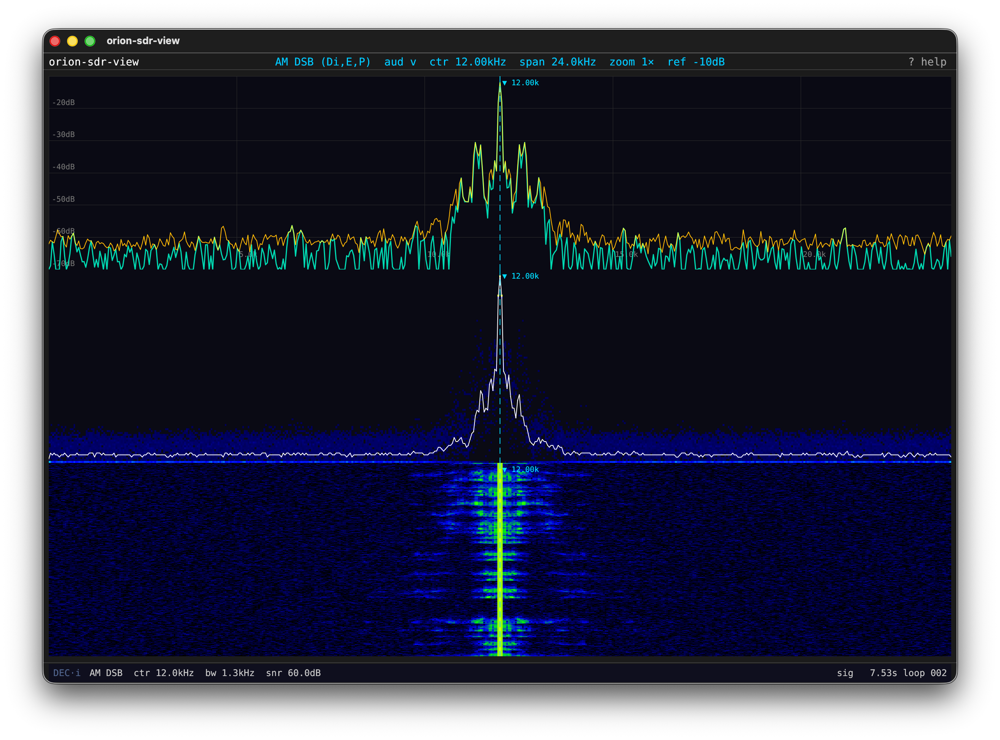

# orion-sdr-view

A keyboard-driven SDR spectrum visualization tool built on [egui](https://github.com/emilk/egui) /
[eframe](https://github.com/emilk/eframe_template). Displays live spectrum, persistence density,
and waterfall from a configurable signal source.

## Features

- **Three display panes** — instantaneous spectrum, persistence density map, and scrolling waterfall
- **Multiple signal sources** — synthetic test tone (sine + AWGN), AM DSB from looped audio, and PSK31 (BPSK31/QPSK31)
- **Frequency pan and zoom** — keyboard-driven viewport with coarse/fine pan snap, coarse/fine zoom, and span steps
- **Source lock** — lock source frequency/carrier to the display center marker; tracks pan, zoom, and span changes
- **Frequency markers** — primary center marker plus two bracket markers (A/B) with label display
- **Settings popover** — live adjustment of display range, source parameters, and signal properties
- **YAML configuration** — startup defaults via `--config <file>` or `.orionsdr.yaml` in CWD

## Requirements

- Rust (edition 2024)
- macOS or Linux (uses OpenGL via `eframe` glow backend)
- [orion-sdr](https://crates.io/crates/orion-sdr) 0.0.26 (pulled automatically from crates.io)

## Screen Shots

### AM-DSB Image Source with Markers

<a href="./docs/images/source-am-dsb.png">
  
</a>

## Building

```sh
cargo build --release
cargo run --release
```

## Configuration

All parameters have built-in defaults. To override at startup, create `.orionsdr.yaml` in the
working directory or pass `--config <path>`:

```yaml
view:
  display:
    db_min: -100.0
    db_max: -20.0
  sources:
    test_tone:
      freq_hz:    12000.0
      noise_amp:  0.05
      amp_max:    0.65
      ramp_secs:  3.0
      pause_secs: 7.0
    am_dsb:
      carrier_hz:    12000.0
      mod_index:     1.0
      loop_gap_secs: 7.0
      noise_amp:     0.05
    psk31:
      mode:          BPSK31   # or QPSK31
      carrier_hz:    12000.0
      loop_gap_secs: 7.0
      noise_amp:     0.05
```

All fields are optional; missing fields fall back to built-in defaults.

## Keyboard Shortcuts

| Key | Action |
| --- | --- |
| `1` / `2` / `3` | Toggle Spectrum / Persistence / Waterfall panes |
| `I` / `M` / `N` | Cycle input source / mode / audio input |
| `C` | Toggle amplitude cycling (Test Tone only) |
| `E` | Toggle persistence envelope overlay |
| `L` | Lock source freq/carrier to display center (tracks pan/zoom/span) |
| `P` | Toggle peak hold line |
| `S` | Open/close settings popover |
| `H` or `?` | Toggle help overlay |
| `Escape` | Dismiss overlays |
| `Q` | Quit |
| `←` / `→` | Pan frequency view (coarse) |
| `Shift+←` / `Shift+→` | Pan frequency view (fine, snap 100 Hz; zooms in first if at full span) |
| `Ctrl+Shift+←` / `Ctrl+Shift+→` | Pan frequency view (extra-fine, snap 10 Hz) |
| `↑` / `↓` | Zoom in / out (±0.5×) |
| `Shift+↑` / `Shift+↓` | Fine zoom in / out (±0.1×) |
| `[` / `]` | Shift dB reference ±5 dB |
| `R` | Reset to full view (0–Nyquist) |
| `A` / `B` (Shift) | Place marker A / B at center |
| `a` / `b` | Toggle marker A / B visibility |
| `Tab` | Cycle active marker |
| `Ctrl+←/→` | Move active marker (coarse) |
| `Alt+←/→` | Move active marker (one FFT bin) |

## License

MIT OR Apache-2.0
