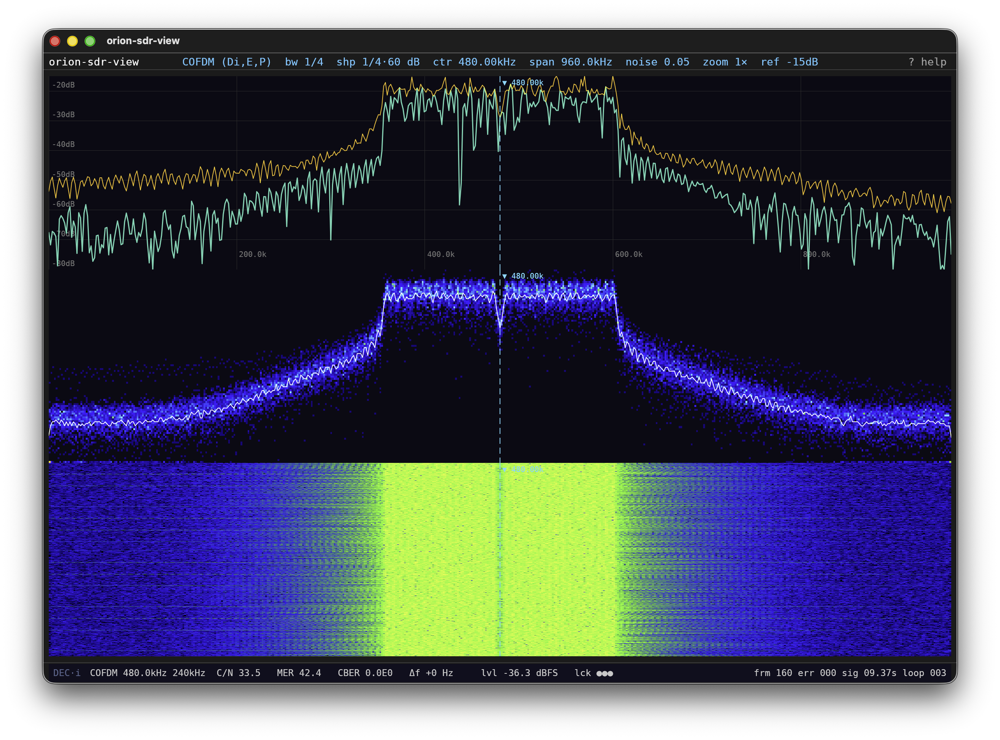

<!--
  Copyright (c) 2026 G & R Associates LLC
  SPDX-License-Identifier: MIT OR Apache-2.0
-->

# orion-sdr-view

A keyboard-driven SDR spectrum visualization tool built on [egui](https://github.com/emilk/egui) /
[eframe](https://github.com/emilk/eframe_template). Displays live spectrum, persistence density,
and waterfall from a configurable signal source.

## Features

- **Three display panes** — instantaneous spectrum, persistence density map, and a cycle-able waterfall
  pane (`W`) that toggles between a vertical waterfall and a horizontal spectrogram centered on the primary
  marker (±freq delta, configurable time range)
- **Multiple signal sources** — synthetic test tone (sine + AWGN), CW (Morse code), AM DSB from looped
  audio, PSK31 (BPSK31/QPSK31), FT8/FT4, and COFDM (wideband coded-OFDM at 1.92 MHz, with a selectable
  occupied-bandwidth fraction and live out-of-band [spectral shaping](#cofdm-spectral-shaping) —
  edge-carrier guard, symbol-window taper, and baseband mask)
- **Decode bar** — optional bottom bar (cycled by `D`) showing signal info
  (Di: modulation, carrier, BW, SNR) or decoded text (Dt: smooth-scrolling teletype ticker)
- **Frequency pan and zoom** — keyboard-driven viewport with coarse/fine pan snap, coarse/fine zoom, and span steps
- **Source lock** — lock source frequency/carrier to the display center marker; tracks pan, zoom, and span changes
- **Frequency markers** — primary center marker plus two bracket markers (A/B) with label display
- **Settings popover** — live adjustment of display range, source parameters, and signal properties
- **YAML configuration** — startup defaults via `--config <file>` or `.orionsdr.yaml` in CWD

## Requirements

- Rust (edition 2024)
- macOS or Linux (renders via `eframe` wgpu backend — Metal/Vulkan)
- [orion-sdr](https://crates.io/crates/orion-sdr) 0.0.56 (pulled automatically from crates.io)

The GUI dependencies (`eframe`, `egui`) are behind an optional `gui` feature
(enabled by default). Use `--no-default-features` to build and test the library
without a windowing system, e.g. on headless CI runners.

## Screen Shots

### AM-DSB Image Source

<a href="./docs/images/source-am-dsb.png">
  
</a>

### COFDM Image Source

<a href="./docs/images/source-cofdm.png">
  
</a>

### COFDM Image Source with Instrumentation

<a href="./docs/images/source-cofdm-instrumented.png">
  
</a>

## Building

```sh
cargo build --release
cargo run --release
```

## Configuration

All parameters have built-in defaults. To override at startup, create `.orionsdr.yaml` in the
working directory or pass `--config <path>`:

```yaml
view:
  display:
    db_min:               -100.0
    db_max:               -15.0
    time_zone:            utc     # "utc", "local", or "+HH:MM" / "-HH:MM"
    spec_time_range_secs: 10.0    # horizontal spectrogram time span
    pan:                  spectrum # arrow pan: "spectrum" (panadapter) or "signal"
    zoom:                 1.0     # startup viewport zoom (1.0 = full 0..Nyquist)
  sources:
    test_tone:
      freq_hz:    12000.0
      amp_max:    0.65
      ramp_secs:  3.0
      pause_secs: 7.0   # dwell at both amplitude extremes (not a gap)
      cn_db:      36.0  # carrier-to-noise ratio in dB (see below)
    cw:
      wpm:         13.0
      jitter_pct:  5.0
      dash_weight: 3.0
      char_space:  3.0
      word_space:  7.0
      rise_ms:     5.0
      fall_ms:     5.0
      canned_text: "CQ CQ CQ DE N0GNR"
      custom_text: "Custom message"
      msg_repeat:  3
      carrier_hz:  12000.0
      gap_secs:    10.0
      cn_db:       45.0
    am_dsb:
      msg_repeat: 1
      carrier_hz: 12000.0
      mod_index:  1.0
      gap_secs:   7.0
      cn_db:      34.0
    psk31:
      mode:        BPSK31             # or QPSK31
      canned_text: "CQ CQ CQ DE N0GNR"
      custom_text: "Custom message"
      msg_repeat:  3
      carrier_hz:  12000.0
      gap_secs:    15.0
      cn_db:       54.0
    ft8:
      mode:       FT8                    # or FT4
      call_to:    CQ
      call_de:    N0GNR
      grid:       FN31
      free_text:  "CQ DX"
      carrier_hz: 12000.0
      gap_secs:   15.0
      cn_db:      55.0
    cofdm:
      center_hz:  480000 # band centre; omit for Nyquist/2 (`fs_hz / 4`)
      fs_hz:      1920000 # native sample rate; sets Nyquist and subcarrier spacing
      bandwidth:  1/4    # occupied BW as a fraction of span: 1/8 1/4 1/3 1/2 2/3 3/4 7/8
      shaping:    true   # out-of-band spectral shaping (default true)
      edge_guard: 111    # null carriers per band edge; omit to derive from `bandwidth`
      include_dc: false  # occupy the DC subcarrier (needs `shaping: true`)
      taper:      1/4    # symbol-window roll-off, as a fraction of the guard: off 1/8 1/4 3/8
      mask:       60     # baseband-mask stop-band depth in dB: off 40 60 80
      sig_secs:   10.0   # signal-burst duration (wall-clock seconds); >= 100 means continuous
      gap_secs:   2.0    # silence gap between bursts (wall-clock seconds)
      cn_db:      35.0   # carrier-to-noise ratio in dB
```

All fields are optional; missing fields fall back to built-in defaults.

### Continuous bursts: `sig_secs`

**A `sig_secs` of 100 or more means the burst never ends.** The `Signal` settings row reaches it as
one press past the top of its finite range, where it reads `cont`; the `Gap` row hides while it is
set, since a burst with no end has no gap after it.

A sentinel rather than a larger maximum, because no usefully long burst is reachable by nudging at a
second per press. Any value at or above the threshold means the same thing, so a config asking for
`1.0e9` gets what it plainly intended.

**This used to be silently impossible.** Every source clamped its burst to 99.99 s — psk31, ft8,
amdsb and cw truncated their rendered buffer, COFDM clamped its phase timer — because the decode-bar
timer renders `sig NN.NN` in a fixed-width field and a wider number would reflow the HUD. A display
constraint was deciding how long a signal could last, and doing it without saying so: a 5-minute
audio file, or an FT8 repeat count that ran long, was simply cut off.

The timer now marks an overflow instead — `sig 99.99+s` — with the marker slot always present so the
field width never changes. That is the same convention the error counter already uses for a wrapped
count, and for the same reason: `99.99` and `99.99+` are very different readings, and clamping
without saying so under-reports silently.

**`sources.cofdm.include_dc` takes effect only with `shaping: true`.** With shaping off the source
renders the bandwidth fraction's own derived plan, which never occupies DC, so the key — and the
matching settings row — are inert. This mirrors `edge_guard`, `taper` and `mask`.

Occupying DC was broken until orion-sdr 0.0.60 and the row was withdrawn for release 0.0.25: the
training symbol never transmitted bin 0, so the channel estimate there was noise and the equalizer
divided by it, taking EVM from −67 dB to **+55 dB** — error power above signal power — with about
half the frames failing on an otherwise clean link. Fixed upstream in 0.0.60; occupying DC now costs
nothing measurable.

Leaving it off remains the right default for anything resembling real hardware, since a
direct-conversion front end puts its LO leakage on bin 0.

### Noise: `cn_db`

Every source expresses its impairment as a **carrier-to-noise ratio in dB** rather than as an
absolute noise amplitude. The generator adds white Gaussian noise scaled so that, integrated over
the signal's occupied bandwidth, it produces the requested ratio:

```text
N0      = P_signal / (B_occupied * 10^(cn_db / 10))
P_noise = N0 * B_noise
```

`B_noise` is the bandwidth the generator's noise is white over — `fs/2` for the real-valued sources,
the full `fs` for the complex-baseband COFDM one. `B_occupied` is declared per source rather than
measured, because a measurement fed back into the impairment would make the noise floor wobble; for
the single-carrier sources (test tone, CW) it is a stated *reference* bandwidth of 500 Hz, which is
what makes a C/N meaningful for a signal that has no bandwidth of its own.

The defaults differ by ~20 dB between sources because their spreading factors do: a 62.5 Hz PSK31
signal against noise spread over 24 kHz is 25.8 dB, where COFDM's 240 kHz against 1.92 MHz is 9 dB.
Five of the six reproduce the noise floor the pre-0.0.23 amplitude default put on screen.

**COFDM is the exception, at 35 dB.** It is set 10 dB noisier on purpose, because the guard, taper
and mask controls exist to shape the skirt *outside* the occupied band and there has to be a floor
on screen for that skirt to sit against. It is a display choice, not a link one — every bandwidth
fraction still decodes with zero frame errors there, against an FEC cliff around 11-14 dB.

Higher is cleaner. There is no "off" — a ratio has no infinite value — but the top of the range
(70 dB) leaves a floor far below anything the display resolves.

`noise_amp` was **removed in 0.0.23**, and through 0.0.24 a config still carrying it was refused
with a message naming the replacement. That window has now run: since 0.0.25 the key is simply
ignored, like any other unrecognised one. There is no automatic conversion — an old config needs
`noise_amp` deleted and `cn_db` set.

### Viewport: `zoom`

`display.zoom` is the **startup** viewport zoom, as a ratio of the full `0..Nyquist` span — `1.0`
shows everything, `4.0` shows a quarter of it. A ratio rather than a span in Hz, so one value means
the same thing on a 48 kHz source and on a 1.92 MHz one.

Precedence, in order:

1. The configured `zoom` applies at startup.
2. Switching **to** a source that states a preferred span reframes to it. COFDM does, to frame its
   band; the five narrowband sources state none and leave the viewport alone.
3. The `↑`/`↓` keys — and the `Zoom` row in the settings popover, which is the same control — apply
   until the next switch.

So `zoom` is a startup default, not a persistent override. `R` on the Display tab restores it.

The reachable range is per source: the zoom stops at a 1 kHz window, which is 24x at 48 kHz and 960x
for COFDM. The `Zoom` row's upper bound follows the active source for that reason, so it can never
display a ratio the viewport has silently refused.

### COFDM band placement: `center_hz` and `fs_hz`

COFDM occupies a sub-band rather than sitting on a carrier, but it still sits *somewhere*.
`center_hz` says where; it defaults to Nyquist/2 (mid-display). `L` (lock source to viewport centre)
retunes it, the same as on the five narrowband sources — zoom in first, since panning has no room at
full span.

`fs_hz` sets the native sample rate, and with it Nyquist, the subcarrier spacing (`fs / 256`) and
every derived bandwidth. It has **no settings row**: changing the rate clears the waterfall,
persistence and spectrogram — bin-indexed history at the old scaling cannot be drawn at the new one
— so a live knob would wipe the display on every keypress.

**The centre and the edge guard are one constraint.** The occupied band must stay inside
`0..Nyquist`, so how wide it can be depends on where it sits: at the default centre the widest band
is 127 carriers per side, and at half that centre only 31 fit. Move the band out and the wider
`bandwidth` fractions are clamped down to what fits. The fraction stays a label; the Di bar's `BW`
readout is authoritative for what is actually transmitted.

Configuring `fs_hz` is safe precisely because the impairment is a ratio. While it was an absolute
amplitude, halving the rate would have silently changed the link by 3 dB with nothing on screen to
say so.

### COFDM spectral shaping

Plain OFDM's out-of-band spectrum decays only as `~1/f`, so the transmitted signal carries a wide
skirt beyond its occupied band. The COFDM source composes the three shaping levers `orion-sdr`
provides, all reachable live from the settings popover (`S`) under a `Shaping` toggle that is **on by
default**:

| Lever | Setting | Where it acts |
| --- | --- | --- |
| Edge-carrier guard | `Edge guard` (null carriers per edge) | narrows the occupied band, moving the strongest `sinc` generators inward |
| Symbol-window taper | `Taper` (roll-off as a fraction of the guard) | the symbol seam — the near skirt, just outside the band edge |
| Baseband mask | `Mask` (stop-band depth) | the spectrum directly — dominates far out |

They compose, and together they beat either alone. `Edge guard` is seeded from the `Bandwidth`
fraction — the two are the same lever, so a narrower fraction already *is* a wider guard — and
nudging it overrides the fraction until `Bandwidth` moves again. Note that the top-line HUD keeps
naming the fraction; once the guard is overridden it is the decode bar's `BW` readout that is
authoritative. With `Shaping` off, all four parameters are ignored and the source emits the
fraction's plain carrier set.

The taper and the mask's group delay share one budget — `roll_off + group_delay ≤ cp_len/2` — since
both have to live in the guard samples a receiver discards. At COFDM's numerology (`n_fft` 256,
`cp_len` 32) that leaves 16 samples, so the mask is necessarily short and the payoff is tens of dB
rather than the 60+ dB a long-guard profile reaches. Tap count is derived from the current edge guard
and clamped to the remaining budget, which is why it is not a setting: no reachable combination can
overrun it, and no mask you ask for is silently dropped. `Taper` stops at `3/8` for the same reason —
`1/2` would spend the whole budget and leave the mask nothing.

See `orion-sdr`'s [modulate.md](https://docs.rs/orion-sdr) → *Out-of-band spectral shaping* for the
geometry and the transparency argument.

### COFDM instrumentation

`X` opens an instrumentation panel for the COFDM source: tuning and RF level, signal quality, the
error ladder, channel delay spread, the carrier-plan configuration, and demodulator lock states. The
decode bar's info line (`D` → Di) carries a prioritised subset of the same readings:

```text
COFDM 480.0kHz 240kHz  C/N 28.0   MER 26.5   CBER <1E-9   Δf +80 Hz   lvl -36.6 dBFS   lck ●●●●  SIM
```

As the window narrows the **lowest-priority fields are dropped** rather than the line being clipped
or scrolled — level first, then frequency error, then the lock run (`lck`, pinned to the right so it
always sits just before the `SIM` badge), leaving `C/N` last. Field widths are fixed, so a value
gaining or losing a digit cannot shift its neighbours.

**It is measured.** The viewer runs a real COFDM receiver: the source's complex baseband is
demodulated frame by frame, and the panel reads carrier offset, MER/EVM, the `CBER`/`IBER` error
ladder, the locks and the frame error count off the received frames. The `SIM` badge is gone —
not removed by hand, but because nothing on the panel is a placeholder any more, which is what
provenance tagging was for.

Three fields stay blank (`—`) rather than being invented: `clk` (there is no sample-clock
estimator), `Δt` and the echo verdict (the inverse transform of a band-limited channel estimate is
a Dirichlet kernel, so a *flat* channel measures a large spread that depends only on the occupancy
— and calibrating that floor out still left a statistic that moved the wrong way for a small echo),
and `TS` lock (generic COFDM has no transport-stream layer). A reading worse than none is worse
than none.

Without a complex-baseband source the panel falls back to a simulation driven from the measured
C/N, rendered dim behind the `SIM` badge — a placeholder that looked measured would be the failure
mode worth designing against. `C/N` itself is a real fix rather than a relabelled SNR: the shared
narrowband estimator compares one peak bin against the noise floor, which a multi-carrier signal
defeats, so COFDM uses the wideband estimator instead.

`lvl`, `pk` and `OVL` are measured against **the source's own full scale, not 1.0**. The COFDM
modulator applies a large fixed gain — bare OFDM at unit gain sits below the decode threshold, and
the f32 spectrum pipeline has no `[-1, 1]` clamp — so raw samples routinely peak above 30. Read
against 1.0 they would report positive dBFS and a permanent overload.

The error metrics form a ladder, each rung named for the stage whose *output* it measures, and all of
them refer to the **inner** FEC — the outer block code is a separate stage:

| Reading | Measured at the output of |
| --- | --- |
| `CBER` | the channel, i.e. before the inner decoder |
| `IBER` | the inner decoder, before the outer |
| `FER` | the whole chain — the *fraction* of frames that fail to decode (`PER` under a packet-oriented profile) |
| `err` | the whole chain — the *count* of frames that have failed in the current burst |

`FER` is a rate and `err` is a running total, so they correlate through the frame rate: `err` advances at
roughly `FER × frames-per-second`, which is in the hundreds here. The count is per-burst — it resets at
each signal gap, since the panel it annotates clears there too — and it wraps at 1 000 000, with a
trailing `+` once it has rolled over.

`CR` is likewise the inner code rate, and the `FEC` lock indicator is the inner decoder converging.
The labels deliberately avoid naming a decoder or a code family — the inner FEC can be LDPC,
convolutional, or absent, so DVB's `VBER` spelling (after the Viterbi algorithm) would only ever be
right for one of them.

## Headless replay

```sh
orion-sdr-view --headless --script demo.txt --dump run.jsonl --duration 30
```

Runs the viewer with **no window, no renderer and no GPU**, driven from a timed key script at a
fixed frame delta, and writes the measurement stream the `Di` bar and the `X` panel consume as
machine-readable records.

A script is plain text, times in absolute seconds:

```text
duration 30                    # run settings: no time column, at most one each
dump     run.jsonl

# t(s)   directive
0.00     key I x5              # cycle to COFDM
0.50     key ArrowUp x3        # zoom in
1.00     key L                 # lock the band to the viewport centre
1.50     text a                # markers arrive as Text, not Key
2.00     assert center_hz 520000
```

A repeat count is **frames, not events**: `key_pressed` is a per-pass boolean, so five press events
inside one pass register as one. `assert` directives are parsed — a typo is still an error — and
then ignored; executing them is the test suite's job. It is one format with two readers, so a
reproduction recipe and a regression test are the same file.

### Run settings, and what overrides what

`duration` and `dump` take no time column, because they configure the run rather than happen during
it. They let a script be a complete recipe — what to press, how long for, and where the answer goes
— instead of a file that needs a remembered command line beside it.

**The command line overrides either**, which is what keeps that recipe reusable: the same script can
be run longer or written elsewhere without being edited. Paths are taken verbatim, so a relative
`dump` resolves against the working directory exactly as `--dump` does.

With neither naming a value:

- **no duration** → the run ends **one second past the last scripted step**. Without that margin it
  would stop on the very frame the last action lands on, and whatever that action was for would
  never be measured.
- **no dump** → nothing is written. The run is still worth doing: it fails on a panic, an
  unparsable script or a dropped chunk just the same.

`--duration` may also be shorter than the script. Every step still runs — the loop waits on the
script as well as the clock — so cutting a run short cannot silently skip the actions that were
asked for.

### Example scripts

Ready-to-run recipes live in [`scripts/`](scripts/), with a one-line description of each in
[`scripts/README.md`](scripts/README.md): measuring a COFDM link, breaking one below the FEC cliff
to see the `null` readings, walking every source, CW decode with its burst timestamps, and a
viewport reproduction recipe built from `assert` directives.

**The same script produces the same bytes.** Both pseudo-random generators are seeded from fixed
constants, and a replay run removes the four impure reads that would otherwise vary: the frame
clock is injected, the decode runs inline rather than on a worker thread, no chunk can be dropped,
and timestamps come from a scripted clock starting at 2026-01-01T00:00:00Z rather than from the
system one. A run therefore reads `|| 00:00:00.033 |` for a burst 33 ms in — legible as elapsed
time and impossible to mistake for a real one.

### The dump

One JSON object per line. JSON Lines rather than CSV because every instrument reading is an
`Option` with a provenance:

```json
{"kind":"header","version":"0.0.26","source":"Test Tone","fs_hz":48000.0,"script_sha256":"3072e5…"}
{"kind":"source","t":0.083,"samples":4000,"source":"COFDM","fs_hz":1920000.0}
{"kind":"info","t":0.483,"samples":102304,"modulation":"COFDM","center_hz":480000.0,"bw_hz":240000.0,"snr_db":34.5}
{"kind":"instrument","t":0.483,"samples":102304,"cn_db":{"v":34.5,"prov":"measured"},"clock_error_ppm":{"v":null,"prov":"unavailable"},…}
{"kind":"summary","t":3.0,"frames":180,"samples":720800,"dropped_chunks":0,"records":20}
```

`null` and `0.0` must stay distinguishable: the BER rungs go absent exactly when the link fails, so
a format that could not hold `null` would render a dead link as a flawless one. `prov` is the same
distinction the panel's `SIM` badge draws — `measured` came off the air, `known` was declared by the
source, `unavailable` has no provider at all.

**`t` is scripted time, not signal time.** The per-frame sample budget is `dt × fs` clamped to 4096,
and at COFDM's 1.92 MHz that clamp binds hard — a 1/60 s frame asks for 32 000 samples and gets
4096. Every record therefore also carries `samples`, the cumulative count actually consumed, which
is the honest measure. `dropped_chunks` in the summary must be zero; a hole breaks a streaming
demodulator's framing, so anything else means the dump measured the harness rather than the link.

A headless run **fails loudly** — non-zero exit and a message on stderr — for an unparsable script,
an unwritable dump, or a dropped chunk. Nobody is watching it, so a quiet failure would look exactly
like a clean run.

## Keyboard Shortcuts

| Key | Action |
| --- | --- |
| `1` / `2` / `3` | Toggle Spectrum / Persistence / Waterfall panes |
| `I` / `M` / `N` | Cycle input source / mode / audio or message |
| `C` | Toggle amplitude cycling (Test Tone only) |
| `D` | Cycle decode bar: off → info (Di) → text (Dt) → off |
| `E` | Toggle persistence envelope overlay |
| `L` | Lock source freq/carrier to display center (tracks pan/zoom/span) |
| `P` | Toggle peak hold line |
| `W` | Cycle pane 3 between vertical waterfall and horizontal spectrogram |
| `R` | Reset source, timers, decode state, and frequency view |
| `S` | Open/close settings popover |
| `X` | Toggle extended instrumentation panel |
| `H` or `?` | Toggle help overlay |
| `Escape` | Dismiss overlays |
| `Q` | Quit |
| `←` / `→` | Pan frequency view (coarse, 1/12 of span per press; zooms in first if at full span) |
| `Shift+←` / `Shift+→` | Pan frequency view (fine, 10% of coarse) |
| `Ctrl+Shift+←` / `Ctrl+Shift+→` | Pan frequency view (extra-fine, 1% of coarse) |
| `↑` / `↓` | Zoom in / out (±0.5×) |
| `Shift+↑` / `Shift+↓` | Fine zoom in / out (±0.1×) |
| `[` / `]` | Shift dB reference ±5 dB |
| `Z` | Center view to mid-band (keeps zoom) |
| `A` / `B` (Shift) | Place marker A / B at center |
| `a` / `b` | Toggle marker A / B visibility |
| `Tab` | Cycle active marker |
| `Ctrl+←/→` | Move active marker (coarse) |
| `Alt+←/→` | Move active marker (one FFT bin) |

## License

MIT OR Apache-2.0
