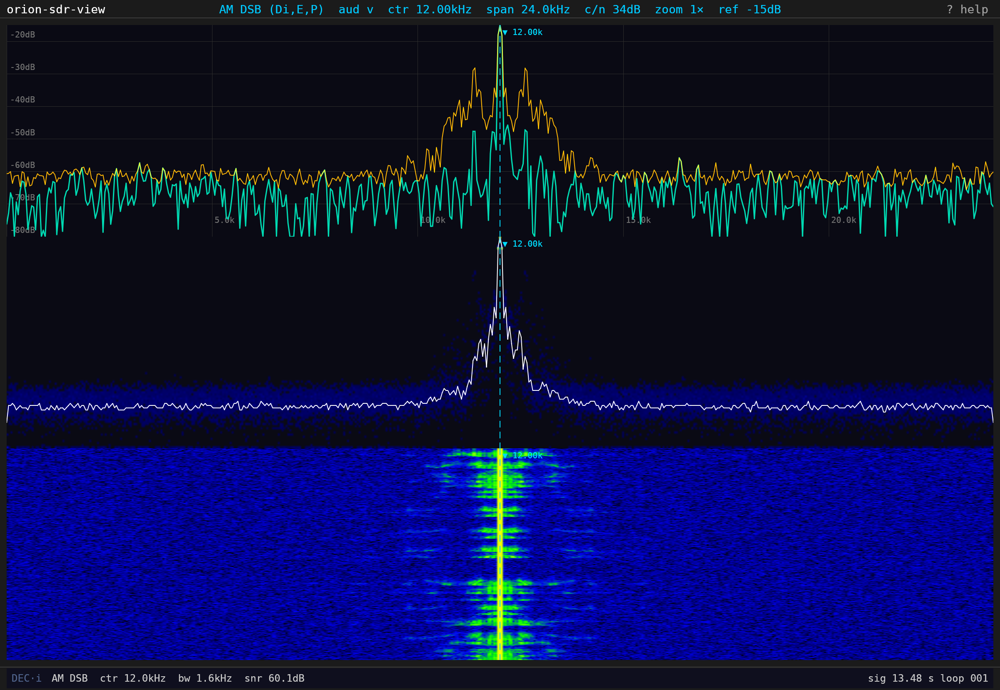
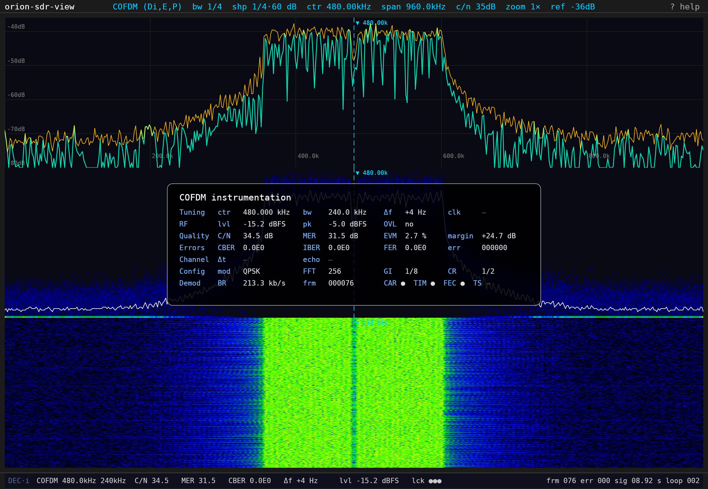
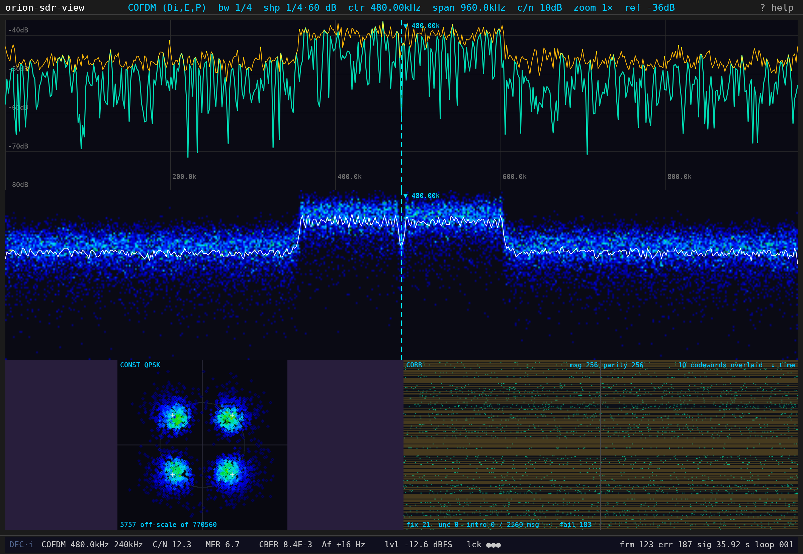

<!--
  Copyright (c) 2026 G & R Associates LLC
  SPDX-License-Identifier: MIT OR Apache-2.0
-->

# orion-sdr-view

A keyboard-driven SDR spectrum visualization tool built on [egui](https://github.com/emilk/egui) /
[eframe](https://github.com/emilk/eframe_template). Displays live spectrum, persistence density,
and waterfall from a configurable signal source.

## Features

- **Three display panes** — instantaneous spectrum, persistence density map, and a cycle-able third
  pane (`W`) rotating through a vertical waterfall, a horizontal spectrogram centered on the primary
  marker (±freq delta, configurable time range), and a split decoder view
- **Multiple signal sources** — synthetic test tone (sine + AWGN), CW (Morse code), AM DSB from looped
  audio, PSK31 (BPSK31/QPSK31), FT8/FT4, and COFDM (wideband coded-OFDM at 1.92 MHz, with a selectable
  occupied-bandwidth fraction and live out-of-band [spectral shaping](docs/cofdm.md) —
  edge-carrier guard, symbol-window taper, and baseband mask)
- **Decode bar** — optional bottom bar (cycled by `D`) showing signal info
  (Di: modulation, carrier, BW, SNR) or decoded text (Dt: smooth-scrolling teletype ticker)
- **COFDM instrumentation** — an `X` panel driven by a real receiver: MER/EVM, the CBER/IBER error
  ladder, carrier offset, lock states, each reading tagged with its provenance
- **COFDM decoder view** — pane 3's third mode, from the same receiver: the equalizer's output as a
  live constellation beside the inner FEC's per-bit outcome, scrolling by codeword. Both halves are
  CPU-side rasters, so they capture headless like every other pane
- **Frequency pan and zoom** — keyboard-driven viewport with coarse/fine pan snap, coarse/fine zoom, and span steps
- **Source lock** — lock source frequency/carrier to the display center marker; tracks pan, zoom, and span changes
- **Frequency markers** — primary center marker plus two bracket markers (A/B) with label display
- **Settings popover** — live adjustment of display range, source parameters, and signal properties
- **YAML configuration** — startup defaults via `--config <file>` or `.orionsdr.yaml` in CWD
- **Image and video capture** — `F` for a still, `V` to record; window decorations excluded by
  construction, an ISO 8601 name, and a JSON sidecar describing the source, span and dB scale
- **Headless replay** — run with no window, renderer or GPU from a timed key script, and write the
  measurement stream as JSON Lines; the same script produces the same bytes

## Requirements

- Rust (edition 2024)
- macOS or Linux (renders via `eframe` wgpu backend — Metal/Vulkan)
- [orion-sdr](https://crates.io/crates/orion-sdr) 0.0.60 (pulled automatically from crates.io)

The GUI dependencies (`eframe`, `egui`) are behind an optional `gui` feature
(enabled by default). Use `--no-default-features` to build and test the library
without a windowing system, e.g. on headless CI runners.

## Screen Shots

All three are headless captures, regenerated by
[`scripts/docs/regen-docs-images.sh`](scripts/docs/regen-docs-images.sh) from the recipes beside it
in [`scripts/docs/`](scripts/docs/) — same size, same moment in the burst, every time.

### AM-DSB Source

### COFDM Source with Instrumentation

### COFDM Source with Constellation and Inner FEC Outcome, C/N 10dB Impairment

## Documentation

- [Build and test commands](docs/commands.md) — the two feature configurations, testing, linting
- [Configuration](docs/configuration.md) — the YAML file and every parameter's default
- [Impairment](docs/impairment.md) — `cn_db`, and why the impairment is a ratio rather than an amplitude
- [Viewport](docs/viewport.md) — `display.zoom`, and what overrides it
- [COFDM](docs/cofdm.md) — band placement, burst timing, spectral shaping, and the instrumentation panel
- [Capture](docs/capture.md) — `F` stills and `V` recordings, their metadata, and what a recording of COFDM is not
- [Headless replay](docs/headless.md) — the script format, the measurement dump, and what makes a run reproducible
- [Keyboard shortcuts](docs/shortcuts.md) — every binding, and how a script reaches it
- [Acronym glossary](docs/acronyms.md) — expansions for the acronyms used on screen and in these docs

## License

MIT OR Apache-2.0
